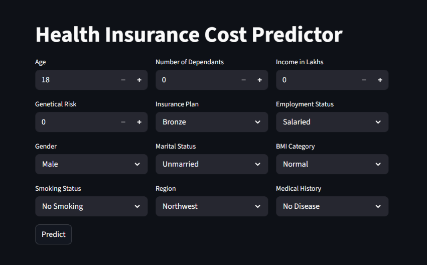
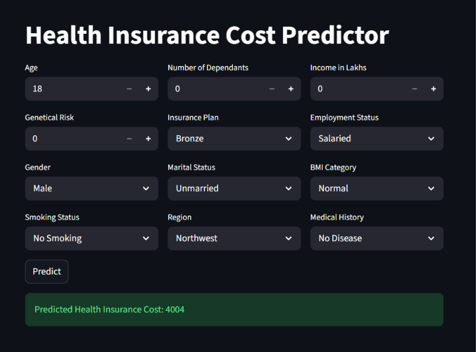

# Premium Prediction

A Machine Learning web application that predicts health insurance premiums based on user-provided personal and health-related information.

Built using Python, Scikit-learn, XGBoost, and Streamlit.

## Dashboard Preview

### Prediction Dashboard



### Prediction Result



## Project Overview

Health insurance premiums depend on several factors such as age, BMI, lifestyle habits, medical history, and other personal characteristics.

This project uses Machine Learning models to estimate the insurance premium based on these input features.

## Features

- Interactive Streamlit web interface
- Health insurance premium prediction
- Separate models for different age groups
- Feature scaling and preprocessing
- XGBoost-based Machine Learning models
- Easy-to-use prediction interface

## Technologies Used

- Python
- Pandas
- NumPy
- Scikit-learn
- XGBoost
- Joblib
- Streamlit

## Project Structure

```text
Premium-prediction/
│
├── artifacts/
│   ├── model_rest.joblib
│   ├── model_young.joblib
│   ├── scaler_rest.joblib
│   └── scaler_young.joblib
│
├── screenshots/
│   ├── home.png
│   └── prediction.png
│
├── main.py
├── prediction_helper.py
├── requirements.txt
├── README.md
└── .gitignore
